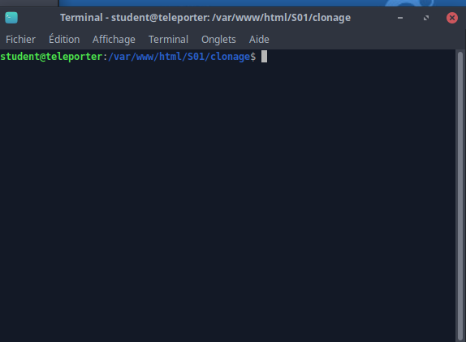
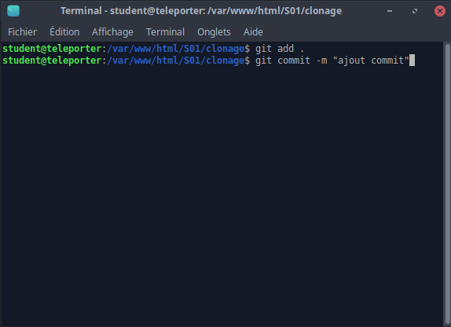

## Commit des changements a nos fichiers

Première étape bien sauvegarder son travail (CTRL+S u Cmd+S selon l'OS) et vérifier qu'on est bien dans le dossier courant (ici EXEMPLEdossier clonage dans S01)

Deuxième étape : `git add .` (ne pas oublier l'espace entre add et .)

Troisième étape : `git commit -m "message descriptif de la modification"`

ensuite entrée et on a la prise en compte :

Quatrième étape : `git push` qui "upload" (ou télécharge en FR) sur github nos changements => cela permets d'avoir une save online a tout moment (incendie, cable alim débranché par le chat...)

Bien lire les messages d'erreur si vous êtes bloqué n'hésitez pas a demander dans la classe !

[Retour à la page principal](../readMe.md)
