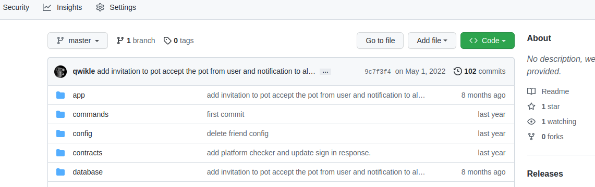
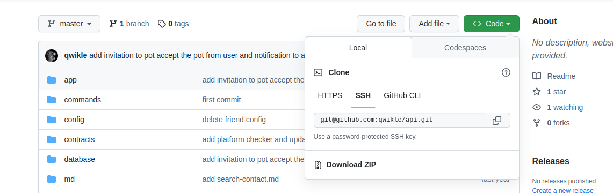
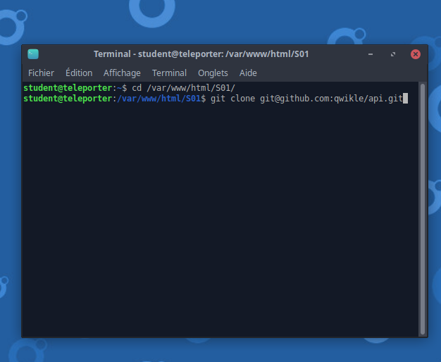
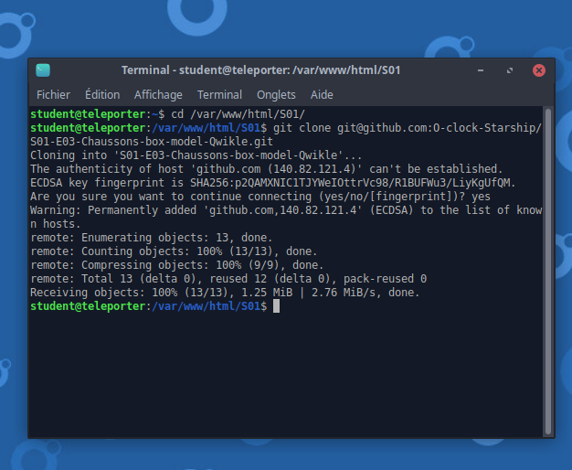
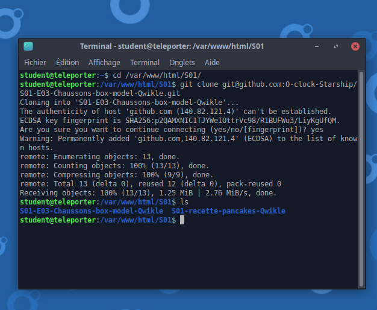
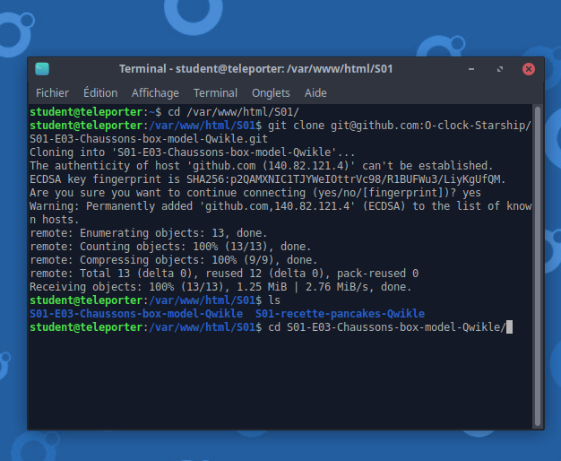
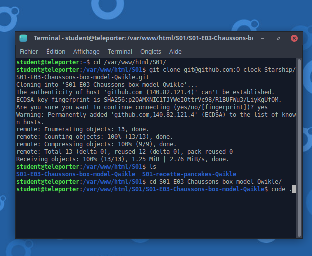

# Cloner un projet sur github durant la formation

- [Lien pour commit](markdown/commit.md)

## Sur le Navigateur

Première étape je vais sur Github pour chercher le repo (projet) qui m'intéresse



je clique sur code et je choisi le lien ssh du repo et je copie le lien



## Retour sur la Virtual Machine

je suis maintenant sur ma machine j'ouvre un terminal et je me dirige vers le dossier de la saison en cours.


```bash
 cd /var/www/html/S01
 ```
 je remplace S01 par la saison en cours


je clone le lien git 

```git
git clone SSHURL
```
SSHURL représente le lien github.




si un message fingerprint s'affiche on répond yes et en commande 'Entrée'



on s'assure ensuite que le dossier est maintenant présent.

```bash
ls
```




et on se dirige vers le dossier du cours concerné.

```bash
cd DossierDuCoursEnQuestion
```




et on fini par lancer vscode

```bash
code .
```


