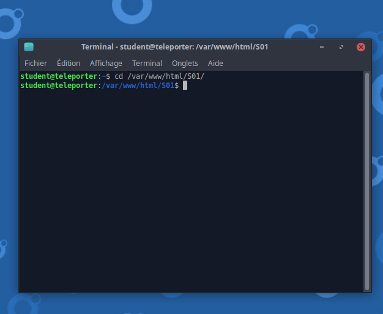

# Cloner un projet sur github durant la formation

## Sur le Navigateur

Première étape je vais sur Github pour chercher le repo (projet) qui m'intéresse


je clique sur code et je choisi le lien ssh du repo et je copie le lien


## Retour sur la Virtual Machine

je suis maintenant sur ma machine j'ouvre un terminal et je me dirige vers le dossier de la saison en cours.


```bash
 cd /var/www/html/S01
 ```
 je remplace S01 par la saison en cours



je clone le lien git 

```git
git clone SSHURL
```
SSHURL représente le lien github.


si un message fingerprint s'affiche on répond yes et en commande 'Entrée'


on s'assure ensuite que le dossier est maintenant présent.

```bash
ls
```


et on se dirige vers le dossier du cours concerné.

```bash
cd DossierDuCoursEnQuestion
```


et on fini par lancer vscode

```bash
code .
```


## Commit des changements a nos fichiers

Prémière étape bien sauvegarder son travail (CTRL+S u Cmd+S selon l'OS) et vérifier qu'on est bien dans le dossier courant (ici EXEMPLEdossier clonage dans S01)


Deuxième étape : `git add .` (ne pas oublier l'espace entre add et .)


Troisème étape : `git commit -m "message descriptif de la modification"`


ensuite entrée et on a la prise en compte :


Troisème étape : `git push` qui "upload" (ou télécharge en FR) sur github nos changements => cela permets d'avoir une save online a tout moment (incendie, cable alim débranché par le chat...)


Bien lire les messages d'erreur si vous êtes bloqué n'hésitez pas a demander dans la classe !

